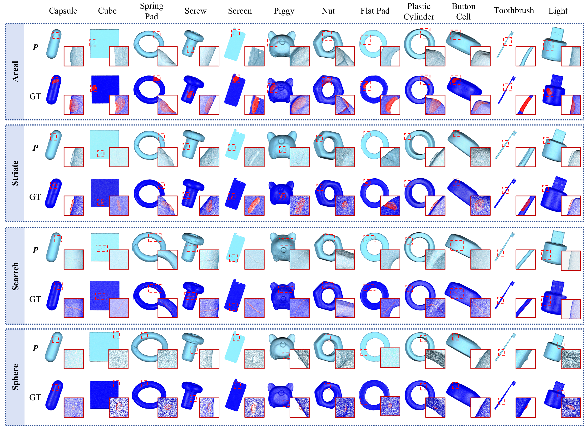

# Towards High-Resolution 3D Anomaly Detection: A Scalable Dataset and Real-Time Framework for Subtle Industrial Defects
🌐 [Hugging Face Dataset](https://huggingface.co/datasets/ChengYuQi99/MiniShift)  


> 📚 [**Paper**]() • 🏠 [**Homepage**](https://hustcyq.github.io/MiniShift-Simple3D)  
> by , [Yuqi Cheng*](https://hustcyq.github.io/), [Yihan Sun*](), [Hui Zhang]() [Weiming Shen](https://scholar.google.com/citations?user=FuSHsx4AAAAJ&hl=en), [Yunkang Cao](https://caoyunkang.github.io/)


## 🚀 Updates  
We're committed to open science! Here's our progress:  
* **2025/07/10**: 📄 Paper released on [ArXiv]().  
* **2025/07/08**: 🌐 Dataset homepage launched.  


## 📊 Introduction  
In industrial point cloud analysis, detecting subtle anomalies demands high-resolution spatial data, yet prevailing benchmarks emphasize low-resolution inputs. To address this disparity, we propose a scalable pipeline for generating realistic and subtle 3D anomalies. Employing this pipeline, we developed **MiniShift**, the inaugural high-resolution 3D anomaly detection dataset, encompassing 2,577 point clouds, each with 500,000 points and anomalies occupying less than 1% of the total. We further introduce **Simple3D**, an efficient framework integrating Multi-scale Neighborhood Descriptors (MSND) and Local Feature Spatial Aggregation (LFSA) to capture intricate geometric details with minimal computational overhead, achieving real-time inference exceeding 20 fps. Extensive evaluations on **MiniShift** and established benchmarks demonstrate that **Simple3D** surpasses state-of-the-art methods in both accuracy and speed, highlighting the pivotal role of high-resolution data and effective feature aggregation in advancing practical 3D anomaly detection.


## 🔍 Overview of MiniShift

### 12 Categories and 4 defect types  
  


### Anchor-Guided Geometric Anomaly Synthesis
  

### Download
You are welcome to try our dataset: [Hugging Face Dataset](https://huggingface.co/datasets/ChengYuQi99/MiniShift)  


## Simple3D
### 🛠️ Getting Started  

Clone and install dependencies:  
```bash  
git clone https://github.com/hustCYQ/MiniShift-Simple3D.git && cd MiniShift-Simple3D  
conda create --name Simple3D_env python=3.8 -y  
conda activate Simple3D_env  

conda install pytorch==1.12.1 torchvision==0.13.1 torchaudio==0.12.1 cudatoolkit=11.3 -c pytorch
pip install tifffile open3d-cpu
pip install --upgrade https://github.com/unlimblue/KNN_CUDA/releases/download/0.2/KNN_CUDA-0.2-py3-none-any.whl
git clone https://github.com/erikwijmans/Pointnet2_PyTorch.git
cd Pointnet2_PyTorch
pip install -r requirements.txt
pip install -e .
cd ..
```  

### 🚀 Train & Evaluate  


```bash  
# Example: Run in MiniShift 
--level : ALL/easy/medium/hard
--vis_save: Save anomaly scores
python ./main.py --dataset minishift --num_group 4096 --group_size 128  --max_nn 40 --use_LFSA True --use_MSND True --num_MSND 2 --expname MiniShift_ALL --level ALL --vis_save True

# Evaluate on other datasets
python ./main.py --dataset real --num_group 4096 --group_size 128  --max_nn 40 --use_LFSA True --num_MSND True --expname real
python ./main.py --dataset shapenet --num_group 4096 --group_size 128  --max_nn 40 --use_LFSA True --num_MSND True --expname shapenet
python ./main.py --dataset mulsen --num_group 4096 --group_size 128  --max_nn 40 --use_LFSA True --num_MSND True --expname mulsen 
```  

**You can selectively reduce group_size and max_nn to balance efficiency and accuracy.**


We also simply reproduced many descriptors for selection, such as SHOT, CVFH, Spin, et al.
```bash  
--feature : FPFH/shape_context/CVFH/NARF/Spin/USC/SHOT
python ./main.py --dataset minishift --num_group 4096 --group_size 128  --max_nn 40 --use_LFSA True --num_MSND True --expname MiniShift_ALL --level ALL --feature SHOT

```  


## 📊 Main Results  
### 1. Performance on MiniShift
  

### 2. Performance on Real3D-AD, Anomaly-ShapeNet, and MulSenAD 
  


## 🙏 Acknowledgements  
Grateful to these projects for inspiration:  
- 🌟 [BTF](https://github.com/eliahuhorwitz/3D-ADS)
- 🎨 [GLFM](https://github.com/hustCYQ/GLFM-Multi-class-3DAD)


## 📖 Citation  
If our work aids your research, please cite:  
```bibtex  
@article{MiniShift_Simple3D,  

}  
```  

## Contact
If you have any questions about our work, please do not hesitate to contact [yuqicheng@hust.edu.cn](mailto:yuqicheng@hust.edu.cn).
